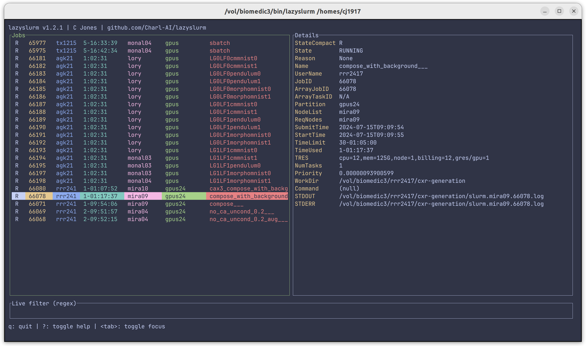
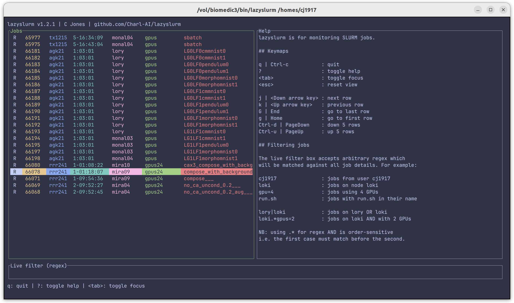

# lazyslurm

`lazyslurm` is for monitoring jobs on your SLURM cluster. It is a TUI app that wraps around SLURM commands such as `squeue` to give a convenient interface for searching, filtering, and inspecting jobs.

  
   

## Installation

Download the static binary from the releases page, or simply clone and run `cargo build --release`.
